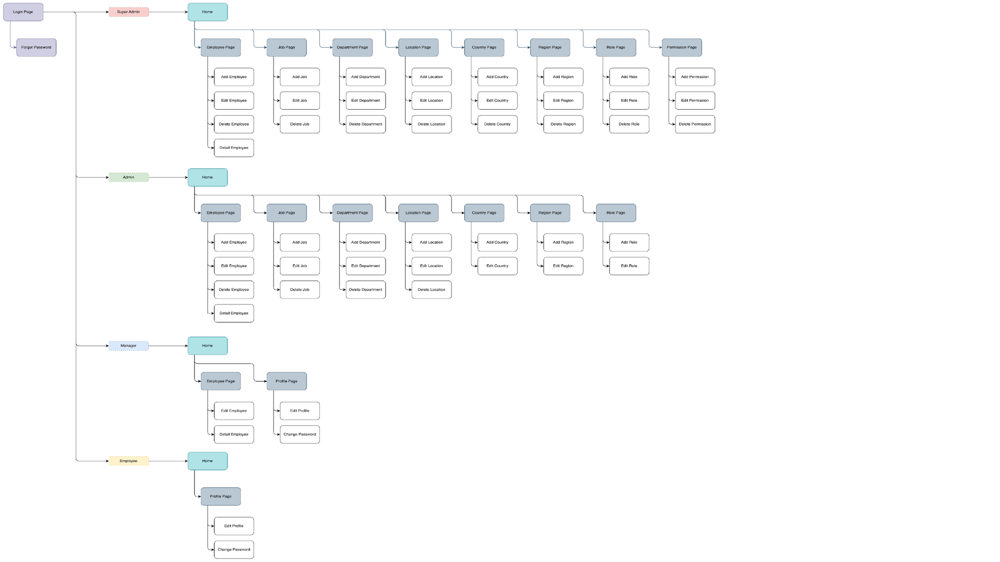

# 👥 Employee Management System (EMS)

## 📚 Overview 
The **Employee Management System (EMS)** was developed to address these evolving operational needs. By centralizing essential information into a structured database, this system ensures that management processes are executed efficiently. It is designed to improve workflow, maintain data integrity, and provide a consistent source of truth for the organization.

Furthermore, this EMS includes a dedicated **Loan Management** feature. This allows employees to easily apply for financial assistance directly through the company, providing a secure alternative to external online lending services. This feature supports employee welfare and contributes to the overall stability and success of the company.

### Objectives
The primary goals of this project are:
* **Efficient Data Management:** To assist the company in recording and processing employee data with high efficiency.
* **User-Centric Design:** To create an intuitive and easy-to-use management system for all administrative levels.
* **Data Integrity & Consistency:** To safeguard the accuracy and reliability of all stored organizational information.
* **Financial Support:** To provide a beneficial financial solution that supports employee wellbeing and financial security.

## 📑 Constraint
This Employee Management System (EMS) features essential modules for corporate operations, including **Employee, Job, Department, Location, Country, Region, Role, Permission, Loan, and Penalty management**. 

The system is structured with four distinct user roles: **Super Admin, Admin, Manager, and Employee**.

## 📐 Information Architecture 
The Information Architecture outlines the permission levels for each role. The Super Admin holds the highest level of authorization with full access to view and manage all data, while the Employee role is assigned the most restricted permissions.

## 🎯 Prerequisite
- SQL Server 
- SQL Server Management Studio (SSMS) 
- Basic Knowledge SQL

